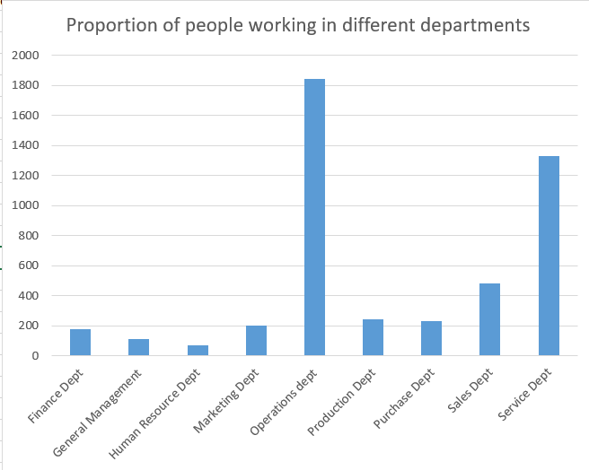
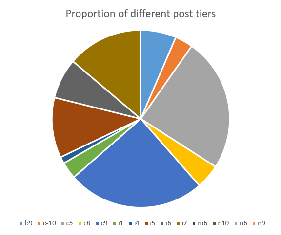

# Hiring Process Analytics Project

## Overview

This project focuses on analyzing the hiring process within our company to gain insights into various aspects of our recruitment efforts. By utilizing Excel and data visualization techniques, I aim to provide a comprehensive understanding of our hiring practices and identify areas for improvement.

## Project Tasks and Outputs

### Task 1: Gender Distribution in Hires

- **Insight:** The hiring process has resulted in 2563 male and 1856 female hires.
- **Recommendation:** Consider gender diversity initiatives to ensure equitable representation and attract a more balanced talent pool.

### Task 2: Average Salary Analysis

- **Insight:** The average salary offered in the company is $49,752.90.
- **Recommendation:** Compare the average salary with industry standards and competitors to optimize our compensation packages.

### Task 3: Salary Distribution by Class Intervals

Class Intervals | Frequency
--- | ---
0-40000 | 2831
40001-80000 | 2963
80001-120000 | 1370
120001-160000 | 0
160001-200000 | 1
... | ...

- **Insight:** Majority of employees fall within the $0-$80,000 salary range.
- **Recommendation:** Review salary distribution for fairness and competitiveness, especially in the higher salary brackets.

### Task 4: Departmental Proportions Visualization

- **Insight:** Operations and Service departments have the highest number of employees.
- **Recommendation:** Assess departmental distribution against strategic goals and consider adjustments if needed.

### Task 5: Post Tier Representation Analysis

- **Insight:** "c9" post tier has the highest representation, followed by "i7" and "c5."
- **Recommendation:** Evaluate post tier distribution for career progression opportunities and alignment with growth plans.

## How to Use

1. Clone this repository to your local machine.
2. Open the Excel file `Hiring Process Analytics.xlsx` to access the dataset used for analysis.
3. Review the Excel sheets for data details and formulas used for calculations.
4. Explore the generated visualizations in the `graphs` directory.
5. Refer to the project report for detailed insights and recommendations.

## Contributions

Contributions to this project are welcome! If you have suggestions for improvements, data enhancements, or new analyses, please feel free to open an issue or submit a pull request.

---

By Ananwita Sarkar

